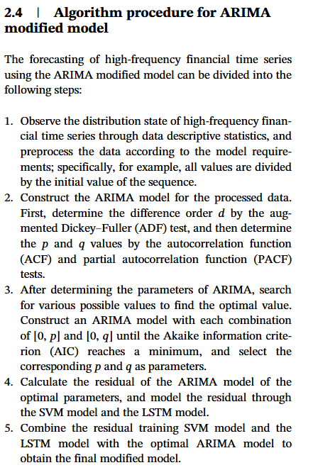
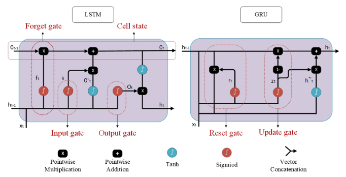
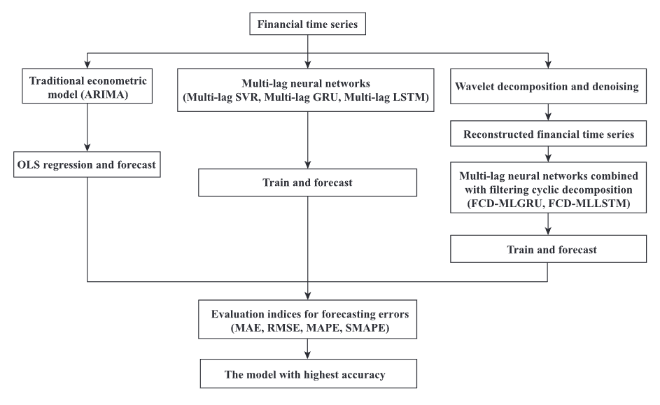

# Forecasting Stocks with high-frequency data

### On the forecasting of high-frequency financial time seriesbased on ARIMA model improved by deep learning
https://onlinelibrary.wiley.com/doi/full/10.1002/for.2677

- Use ARIMA on high frequency data, expand ARIMA with LSTM
- Deep Learning is used as error correction which can compensate for nonlinear features in high-frequency settings:

- ARIMA models makes predictions and LSTM forecasts the error. These two forecasts are then added together. 
- Basically, LSTM is just predicting the sequence of residuals based on the last observed residuals
- Diebold-Mariano Test for testing forecasting accuracy of different models (gives a answer to the question which model did better forecasting)

#### Further Research Ideas
- Apply same approach to optimize forecasting models such as GARCH for the volatility of high-frequency time series

### Volatility forecasting for stock market incorporatingmacroeconomic variables based on GARCH-MIDAS anddeep learning models
https://onlinelibrary.wiley.com/doi/epdf/10.1002/for.2899

- incorporate macroeconomoic variables to forecast short-term volatility within a GARCH-MIDAS model
- Use short-term volatility as input indicator to ML/DL models to forecast the realized volatility
- DL model used: gated recurrent unit (GRU) which is based on LSTM

### Stock index prediction based on wavelet transform and FCD-MLGRU
https://onlinelibrary.wiley.com/doi/epdf/10.1002/for.2682

- wavelet transform, filter cycle decomposition, multi lag gated recurrent unit (WT-FCD-MLGRU)
- Empirical Analysis workflow:

- ARIMA model OLS as benchmark
- data: daily closing prices of stock indices